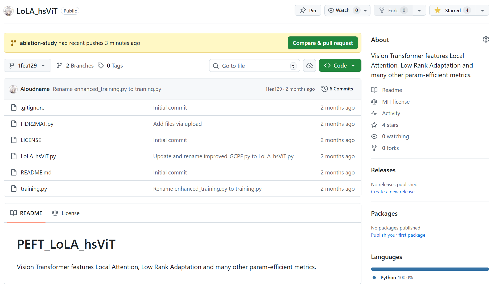
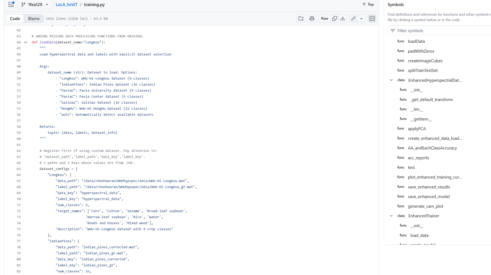

# 工作日志
## 2025.12
### 12.20

- 确定技术路线：
``[1] Zidi, Fadi Abdeladhim et al. LoLA-SpecViT: Local Attention SwiGLU Vision Transformer with LoRA for Hyperspectral Imaging``
- 研究文献提供的LoLA结构，其含有**低秩适配(Low Rank adaption)**＋**局部注意力机制(Local Attention)**。

### 12.26 
- 新建GitHub项目LoLA-hsViT(结构如**图1**)
- 采用公开地理遥感高光谱数据集：
https://rsidea.whu.edu.cn/resource_WHUHi_sharing.htm
- 定义了``HDR2MAT.py``、``LoLA_hsViT.py``、``training.py``, 分别完成了对原始高光谱数据集的读取、处理、转换，模型的构建、训练和可视化。训练的参数完全内置于类和函数内部，超参数全部定义在``training.py``文件头部，且需要在文件内手动注册数据集格式（如**图2**）

**图1**

**图2**


### 12.28
- 用公开数据集``WHU-Hi-LongKou``在组服务器上跑通了程序，包括原始数据转换、数据集构建、特征波段筛选、服务器部署训练。
- **问题**: 原程序提供的结果展示和可视化方法太少，接口不明显。尝试改进，引入CAM。

## 2026.1
### 1.4
确定项目的整体任务：
- 构建标准化的高光谱数据采集与标准化预处理流程；
- 由最初的单纯PCA分析，完善到结合甲状旁腺组织学与生理光学特性的，有高判别力的光谱与空间融合特征筛选方法；
- 设计并实现适用于高光谱数据的Vision Transformer架构，完成甲状旁腺与周边组织的像素级精准分类；
- 轻量优化模型参量和训练算法，减小内存显存占用；实现多卡并行计算；
- 融合高光谱数据与其它可能的信息，通过跨模态注意力机制实现特征互补；
- 并通过多中心数据验证模型的泛化能力、鲁棒性，对训练好的模型进行简单部署，测试其实时性能，评估其临床转化潜力；
- 总结上述结论，尝试提出一整个标准化的流程:


### 1.11
- 毕设项目背景研究：
``[1] 高光谱遥感图像处理方法及应用, 赵春晖`` 前两章：理论基础、特征提取技术
``[2] Woo, S., Park, J., (2018). CBAM: Convolutional Block Attention Module.vol 11211. Springer, Cham``
- 撰写开题报告；

### 1.20
- 毕设项目部署技术研究：
边缘部署和``Nvidia Jetson Orin NX``
- 毕设项目技术路线研究：
``[1] ZHANG Bing. Advancement of hyperspectral image processing and information extraction[J]. Journal of Remote Sensing``
- 研究在抽象基类基础上构建各类(`.mat`, `.tiff`等)数据集的方法，共用接口：
```python
class AbstractHyperspectralDataset(ABC, Dataset):
    @abstractmethod
    def _load_data(self) -> None:

    @abstractmethod
    def _preprocess_data(self) -> None:

    @staticmethod
    def _pad_with_zeros() -> np.ndarray:

    def _validate_raw_data(self) -> None:

    def _create_patches(self) -> None:

    def splitTrainTestDataset(self):

    def __len__(self) -> int:

    def __getitem__(self, idx: int) -> Tuple[torch.Tensor, torch.Tensor]:

class MatHyperspectralDataset(AbstractHyperspectralDataset)

class TiffHyperspectralDataset(AbstractHyperspectralDataset)
```

### 1.30
- 优化项目架构：
将不同功能的程序分装，创建结构如图
```
LoLA_hsViT/
├── config/                   # 参数设置
│   ├── __init__.py
│   ├── config.yaml
│   └── config_yaml.py
├── model/                    # 模型定义
│   ├── __init__.py
│   └── lola_vit.py
├── pipeline/                 # 工作流类
│   ├── __init__.py
│   ├── dataset.py            # 数据集类
│   └── trainer.py            # 训练器类
├── train.py                  # 模型训练入口
├── README.md
├── requirements.txt
└── ...
```
实现了工作程序中端到端的参数和方法传入。

### 2.6
- 修改数据集接口，新增`.npy`格式(`numpy`数组)高光谱数据集的导入方法，适配毕设任务。
- 更换甲状旁腺的高光谱数据集。来自**112名受试者**的**163组数据**，包括LU(left-upper), RD, RU, LD多类型数据。

### 2.14
- 调研现有临床路线的相关文献
```
[1] Lu G, Fei B. Medical hyperspectral imaging: a review. J Biomed Opt. 2014 Jan;19(1):10901. doi: 10.1117/1.JBO.19.1.010901. PMID: 24441941; PMCID: PMC3895860.
[2] Halicek M, Fabelo H, Ortega S, Callico GM, Fei B. In-Vivo and Ex-Vivo Tissue Analysis through Hyperspectral Imaging Techniques: Revealing the Invisible Features of Cancer. Cancers (Basel). 2019 May 30;11(6):756. doi: 10.3390/cancers11060756. PMID: 31151223; PMCID: PMC6627361.
```

### 2.20
- 年后开工，增添了固定参数的普通`Vision Transformer`和`U-net`用于对比分析；
- 调试模型，增加`pipeline/monitor.py`用于对训练时内存显存占用的实时分析：
<video controls src="src/monitor.mp4" title="monitor"></video>

### 2.22
- 在固定参数对比训练的基础上，增添针对两种ViT的消融实验，以确定最简结构的有效模型；
- 准备`TensorRT`推理部署；
- 系统整理收集到的临床理论文献，准备写作论文初稿。