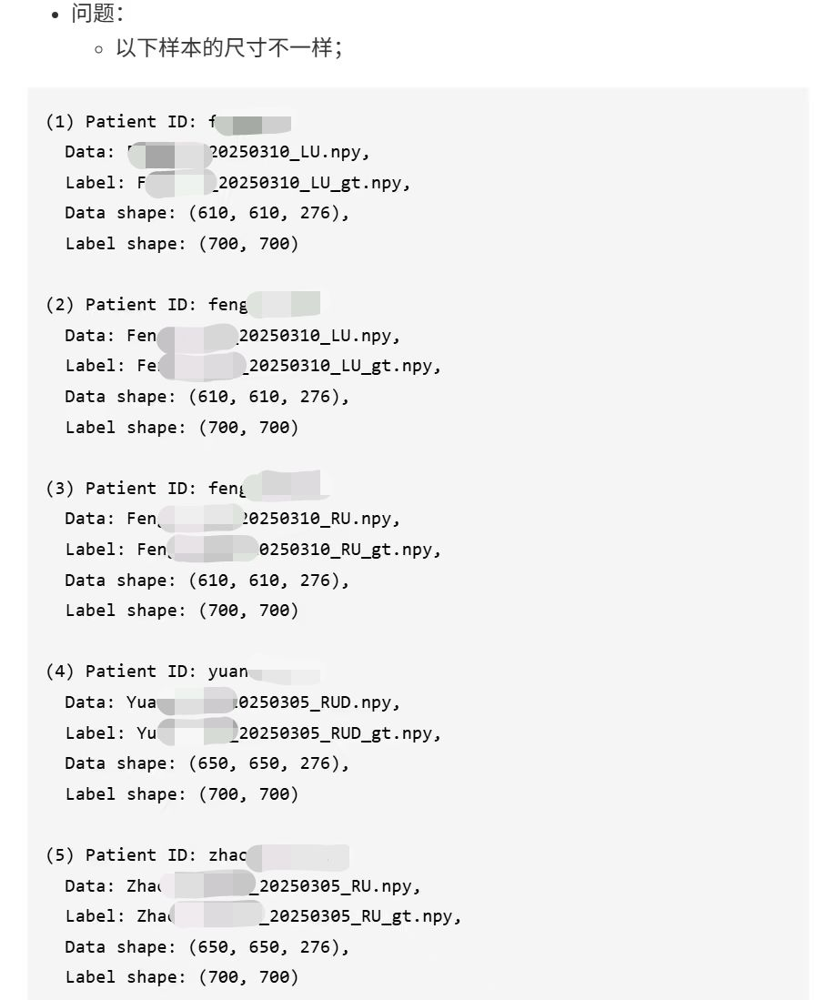
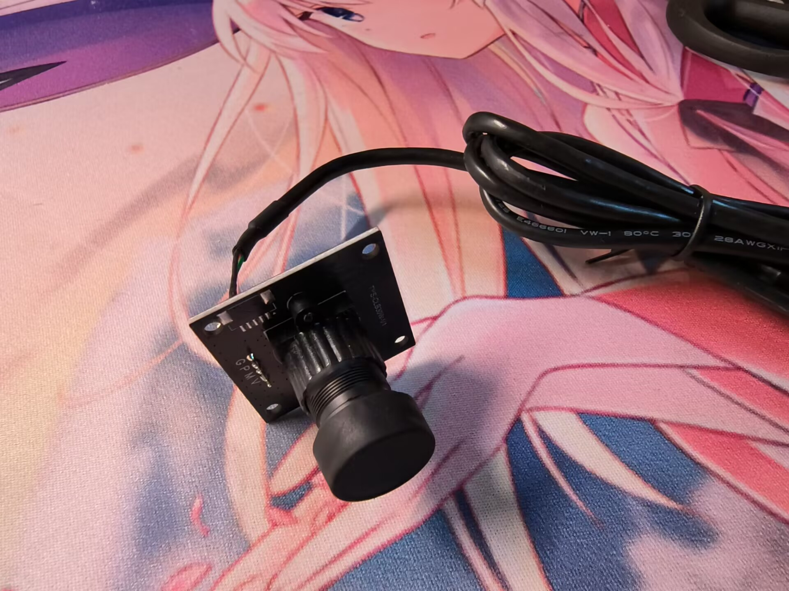
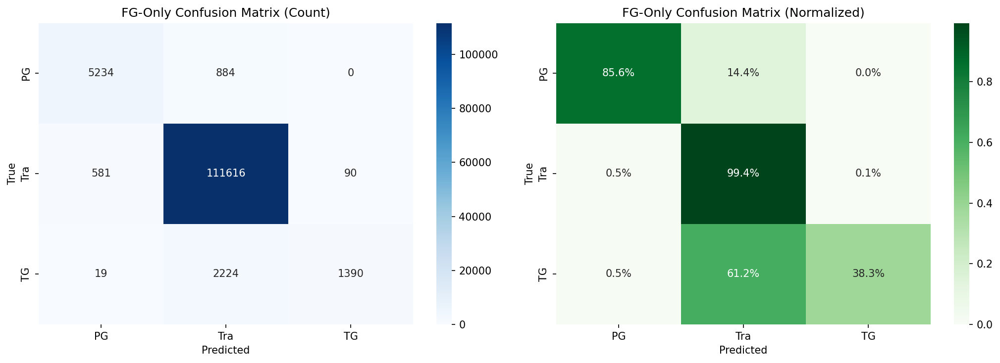
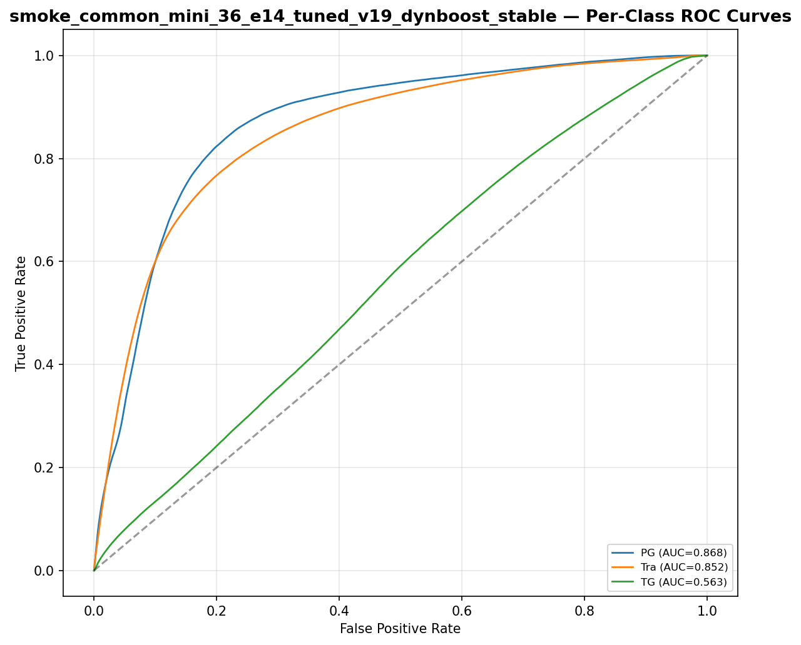
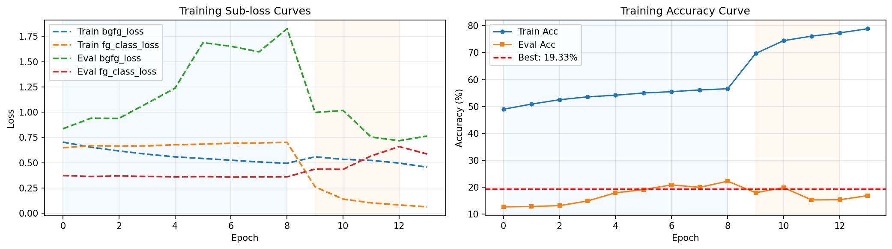

# 工作日志

项目代码在(LoLA_hsViT)[https://github.com/Aloudname/LoLA_hsViT.git]
以及(StreamCat)[https://github.com/Aloudname/StreamCat.git]

## 2025.12

### 12.20

- 确定技术路线：
`[1] Zidi, Fadi Abdeladhim et al. LoLA-SpecViT: Local Attention SwiGLU Vision Transformer with LoRA for Hyperspectral Imaging`
- 研究文献提供的LoLA结构，其含有**低秩适配(Low Rank adaption)**＋**局部注意力机制(Local Attention)**。

### 12.26 
- 新建GitHub项目LoLA-hsViT(结构如**图1**);
- 采用公开地理遥感高光谱数据集：
https://rsidea.whu.edu.cn/resource_WHUHi_sharing.htm
- 定义了`HDR2MAT.py`、`LoLA_hsViT.py`、`training.py`, 分别完成了对原始高光谱数据集的读取、处理、转换，模型的构建、训练和可视化。训练的参数完全内置于类和函数内部，超参数全部定义在`training.py`文件头部，且需要在文件内手动注册数据集格式（如**图2**）。

**图1**

**图2**


### 12.28
- 用公开数据集`WHU-Hi-LongKou`在组服务器上跑通了程序，包括原始数据转换、数据集构建、特征波段筛选、服务器部署训练。
- **问题**: 原程序提供的结果展示和可视化方法太少，接口不明显。尝试改进，引入CAM。

## 2026.1
### 1.4
确定项目的整体任务：
- 构建标准化的高光谱数据采集与标准化预处理流程；
- 由最初的单纯PCA分析，完善到结合甲状旁腺组织学与生理光学特性的，有高判别力的光谱与空间融合特征筛选方法；
- 设计并实现适用于高光谱数据的Vision Transformer架构，完成甲状旁腺与周边组织的像素级精准分类；
- 轻量优化模型参量和训练算法，减小内存显存占用；实现多卡并行计算；
- 融合高光谱数据与其它可能的信息，通过跨模态注意力机制实现特征互补；
- 并通过多中心数据验证模型的泛化能力、鲁棒性，对训练好的模型进行简单部署，测试其实时性能，评估其临床转化潜力；
- 总结上述结论，尝试提出一整个标准化的流程:

```mermaid
graph LR
    A[收集数据] --> B[处理数据]
    B --> C[训练模型]
    C --> D[优化模型]
    D --> E[部署模型]
    E --> F[临床测试]
    
    style A fill:#e1f5fe,stroke:#01579b
    style B fill:#fff3e0,stroke:#e65100
    style C fill:#e8f5e8,stroke:#1b5e20
    style D fill:#f3e5f5,stroke:#4a148c
    style E fill:#ffebee,stroke:#b71c1c
    style F fill:#ede7f6,stroke:#311b92
```

### 1.11
- 毕设项目背景研究：
`[1] 高光谱遥感图像处理方法及应用, 赵春晖` 前两章：理论基础、特征提取技术;
`[2] Woo, S., Park, J., (2018). CBAM: Convolutional Block Attention Module.vol 11211. Springer, Cham`;
- 撰写开题报告；

### 1.20
- 毕设项目部署技术研究：
边缘部署和`Nvidia Jetson Orin NX`
- 毕设项目技术路线研究：
`[1] ZHANG Bing. Advancement of hyperspectral image processing and information extraction[J]. Journal of Remote Sensing`
- 研究在抽象基类基础上构建各类(`.mat`, `.tiff`等)数据集的方法，共用接口：
```python
class AbstractHyperspectralDataset(ABC, Dataset):
    @abstractmethod
    def _load_data(self) -> None:

    @abstractmethod
    def _preprocess_data(self) -> None:

    @staticmethod
    def _pad_with_zeros() -> np.ndarray:

    def _validate_raw_data(self) -> None:

    def _create_patches(self) -> None:

    def splitTrainTestDataset(self):

    def __len__(self) -> int:

    def __getitem__(self, idx: int) -> Tuple[torch.Tensor, torch.Tensor]:

class MatHyperspectralDataset(AbstractHyperspectralDataset)

class TiffHyperspectralDataset(AbstractHyperspectralDataset)
```

### 1.30
- 优化项目架构：
将不同功能的程序分装，创建结构如图
```
LoLA_hsViT/
├── config/                   # 参数设置
│   ├── __init__.py
│   ├── config.yaml
│   └── config_yaml.py
├── model/                    # 模型定义
│   ├── __init__.py
│   └── lola_vit.py
├── pipeline/                 # 工作流类
│   ├── __init__.py
│   ├── dataset.py            # 数据集类
│   └── trainer.py            # 训练器类
├── train.py                  # 模型训练入口
├── README.md
├── requirements.txt
└── ...
```
实现了工作程序中端到端的参数和方法传入。

### 2.6
- 修改数据集接口，新增`.npy`格式(`numpy`数组)高光谱数据集的导入方法，适配毕设任务。
- 更换甲状旁腺的高光谱数据集。来自**112名受试者**的**163组数据**，包括LU(left-upper), RD, RU, LD多类型数据。

### 2.14
- 调研现有临床路线的相关文献
```
[1] Lu G, Fei B. Medical hyperspectral imaging: a review. J Biomed Opt. 2014 Jan;19(1):10901. doi: 10.1117/1.JBO.19.1.010901. PMID: 24441941; PMCID: PMC3895860.
[2] Halicek M, Fabelo H, Ortega S, Callico GM, Fei B. In-Vivo and Ex-Vivo Tissue Analysis through Hyperspectral Imaging Techniques: Revealing the Invisible Features of Cancer. Cancers (Basel). 2019 May 30;11(6):756. doi: 10.3390/cancers11060756. PMID: 31151223; PMCID: PMC6627361.
```

### 2.20
- 年后开工，增添了固定参数的普通`Vision Transformer`和`U-net`用于对比分析；
- 调试模型，增加`pipeline/monitor.py`用于对训练时内存显存占用的实时分析：


### 2.22
- 在固定参数对比训练的基础上，增添针对两种ViT的消融实验，以确定最简结构的有效模型；
- 准备`TensorRT`推理部署；
- 系统整理收集到的临床理论文献，准备写作论文初稿。

### 2.23
- 采用小批次优化了数据标准化的执行速度和资源占用。
- 修改了一些BUG：
  1) 优化没删干净的全局标准化代码，致标准化两次，执行很慢；
  2) 新增受试者批处理，避免同一受试者数据泄露致测试精度虚高。
- **问题**： 引入强正则化后，训练集和验证集的`accuracy gap`仍然差30%，
`test acc`在65%停滞，其余提高泛化能力的手段(**Model EMA**，Exponential Moving Average)作用不明显。怀疑是数据集划分和样本偏差问题。

### 2.24
分析了数据集样本和标签分布。
- 整体类别分布（383 万样本，112 位受试者）

| 类别           |    样本数 | 占比 |
| ------------- | -------- | --- |
| TG (甲状腺)     | 1,300,832 | 33.9% |
| Tra (气管)      | 1,156,124 | 30.2% |
| MS (肌肉)       |   773,472 | 20.2% |
| PG (甲状旁腺)   |   289,773 |  7.6% |
| FAT            |   168,961 |  4.4% |
| ES (食管)      |    83,148 |  2.2% |
| Blood          |    41,598 |  1.1% |
| LN (淋巴结)     |    18,871 |  0.5% |

- 两个类出现 >5% 的占比偏移：

|类别 | train    |     test              |
| --  | ------  | ---------------------- |
|Tra  |  27.1%  |  40.4% (Δ = -13.3%)    |
|MS   |  21.6%  | test 15.5% (Δ = +6.1%) |

测试集中`Tra`样本严重过多，MS样本少。

- 受试者级别:
大量受试者缺失多数类别。例如 16 位受试者只含 `PG` 一个类（其余 7 类全部 missing）。`LN`, `Blood`, `ES` 三个稀有类仅分布在少部分受试者中，patient-level split 时极易导致某些类在测试集中几乎消失。这可能是 30% acc gap 的根因。

- 标签不平衡: 模型偏向预测 `TG`, `Tra`, `MS` 三大类即可获得 > 84% 的表面准确率，但泛化能力差。`Tra` 在测试集占 40%（训练集仅 27%），模型没见过足够多样的 Tra 样本。此外, `LN`, `Blood`, `ES` 仅存在于少数受试者中，划分后某一侧样本极少，模型学不到有效特征。

### 3.2
- 为保证学习质量，仅学习`PG`、`TG`、`Tra`三类，按照训练（像素）比`2：10：7`进行划分，参数为：
  - `patch_size` = 31
  - `pca_components` = 48
  - structure = `[1, 1, 2]`
  - `epochs` = 10

- 结果如下：


### 3.6
优化了工作流。

- 新增core.py、visualize.py，将功能和封装单拎出来。
- 新增数据集分析入口analyzer.py，兼容入口程序run.py。

用法：
```bash
bash

python run.py -a
```

### 3.7

- 修改`save_model`方法，现在保存为`.onnx`文件。
- 规整消融实验逻辑，去除`ablation.py`，将其功能下放至不同层的程序中：
  - 将衍生模型定义迁至`models`文件夹内，采用继承的方法创建不同结构的同类模型。
  - 扩充`core.py`的`ModelFactory._registry`字典，兼容衍生子类。
  - 合并`ablation.py`和`run.py`的训练逻辑。用户接口统一划入`run.py`。
- 应当继续做类别平衡调整。


### 3.13

- 加入了Nvidia MONAI推理前端：
https://github.com/Aloudname/StreamCat.git
详见`StreamCat/README.md`。提供流式的视频帧/单/批次hsi数据输入、本地(`localhost:8000`)部署、快速http响应。
启动效果：


### 3.17

- 采用新标记的数据集，有五例样本的数据标签和图像尺寸不匹配，忽略处理。

- 去除不匹配的数据后，用于构建数据集的样本共**135例**，来自**96位**受试者。
- 每例样本格式为`Name_YYMMDD_Direction_Merged.mat`，储存在`bishe/mat`，含键值：
  - `img`: 原始光谱数据，`(C, H, W)` = `(276, 700, 700)`；
  - `gt_label`: 对应标签数据，`(H, W)` = `(700, 700)`。

- 其标签类别和占比如下：

| 类别           |  占比  |
| ------------  | ----- |
| TG (甲状腺)    | 33.9% |
| Tra (气管)     | 30.2% |
| PG (甲状旁腺)   |  7.6% |

- 分别采用fisher指标统计（剩余96）、直接PCA截取（剩余48、31、15）两种手段降维，分别生成`bishe/fisher`、`bishe/pca_48`、`bishe/mat_31`、`bishe/mat_15`目录。保存格式均为numpy数组，保存名称为`Name_YYMMDD_Direction.npy`（数据文件）以及对应的`Name_YYMMDD_Direction_gt.npy`（标签文件）。
- 另外有RGB图像`(C, H, W)` = `(3, 700, 700)`，用于对照确认图像质量。其目录为`bishe/rgb`，命名格式为`Name_YYMMDD_Direction_Merged_rgb.png`。
- 购置RGB摄像头，用于本地测试。



### 3.20

- 改进训练流程，用自定义上下文管理器封装各阶段。
- 前期实验发现对前景像素分类效果不理想，因此考虑将单独的分类头变为二阶段分类头。第一个分类头`fg_bg_head`，用于专门分割前景背景；第二个分类头`fg_class_head`，用于在前景类内部分类不同的像素。
- 训练阶段做对应调整，采用`HierarchicalSegLoss`损失，定义为：

$$
\mathcal{L}_{\text{total}} = w_{\text{cls}} \cdot \mathcal{L}_{\text{cls}} + w_{\text{bgfg}} \cdot \mathcal{L}_{\text{bin}}
$$

- 其中，$w_{\text{cls}}$为对前景/背景二分类损失$\mathcal{L}_{\text{cls}}$的权重，$w_{\text{bgfg}}$为对前景/背景二分类损失$\mathcal{L}_{\text{bin}}$的权重。以下为详细推导。

---

#### 推导过程

定义：**在模型最后一层未激活的原始输出**为**logits**，logits反映了各类别的未归一化得分。

对真实类别为 $y$ 的单个像素，设模型输出的 logits 为 $\mathbf{z} \in \mathbb{R}^{C}$。

对于整个批次，原始形状为 `(B, C, H, W)`，在损失计算前会被展平为 `(N*H*W, C)`，然后对每个像素独立计算。

首先通过 softmax 将 logits 转换为概率 $p_c$：

$$
p_c = \frac{\exp(z_c)}{\sum_{j=1}^C \exp(z_j)},\quad c=1,\dots,C
$$

定义真实类别上的概率为 $p_t$，得 $p_t = p_y$。

对于容易区分的样本，需降低其权重，对难分类别样本分配更多注意力。
因此，Focal Loss 引入调制因子 $(1-p_t)^\gamma$ 来降低易分样本的权重：

$$
\mathcal{L}_{\text{FL}} = - (1-p_t)^\gamma \log(p_t)
$$

接下来对于有无标签平滑的两种情况，分别讨论。

**(1) 无标签平滑**

此时损失为：

$$
\mathcal{L}_{\text{FL}} = - (1 - p_t)^\gamma \log(p_t)
$$

若有类别权重 $w_y$，则乘以该权重：

$$
\mathcal{L}_{\text{FL}} = - w_y \cdot (1 - p_t)^\gamma \log(p_t)
$$

**(2) 带标签平滑**

设平滑因子为 $\varepsilon$，平滑后的目标分布为：

$$
q_c = (1 - \varepsilon) \cdot \mathbf{1}_{c=y} + \frac{\varepsilon}{C}
$$

此时损失为：

$$
\mathcal{L}_{\text{FL}}^{\text{smooth}} = - (1 - p_t)^\gamma \sum_{c=1}^C q_c \log(p_c)
$$

若有权重 $w_y$，则乘以 $w_y$：

$$
\mathcal{L}_{\text{FL}}^{\text{smooth}} = - w_y \cdot (1 - p_t)^\gamma \sum_{c=1}^C q_c \log(p_c)
$$

---

根据上述推导，可组合得出 $\mathcal{L}_{\text{total}}$，即`HierarchicalSegLoss`损失函数的表达式。

将分割任务分解为**背景/前景二分类**和**前景子类多分类**两部分。
设总类别数为 $C_{\text{total}}$，其中 $0$ 为背景， $\{1,\dots,C_{\text{total}}-1\}$ 为前景子类。
原始目标标签 $y \in \{0,\dots,C_{\text{total}}-1\}$，忽略索引记为 $\text{ignore}$。

模型输出有两个分支：
- $\mathbf{z}_{\text{bg}}$：二分类 logits，形状为 `(N*H*W, 2)`
- $\mathbf{z}_{\text{fg}}$：前景子类 logits，形状为 `(N*H*W, C-1)`

对应于两个分支，模型输出包含两部分的损失如下。

**(1) 前景子类损失**

构造前景子类标签 $y_{\text{fg}}$：

$$
y_{\text{fg}} = \begin{cases}
y - 1, & \text{if } y > 0 \\
\text{ignore}, & \text{otherwise}
\end{cases}
$$

前景子类损失直接使用标准 `FocalLoss`（公式 `1.1` 或 `1.2`，带类别权重和标签平滑）：

$$
\mathcal{L}_{\text{fg}} = \text{FocalLoss}(\mathbf{z}_{\text{fg}},\; y_{\text{fg}})
$$

**(2) 二分类损失**

二分类时，logits 为标量 $z\in\mathbb{R}$，经 sigmoid 得前景概率 $p = \sigma(z) = \frac{1}{1+e^{-z}}$，背景概率为 $1-p$。
另指出，在该阶段还未细粒度区分前景中的各类标签，因此记 $0$ 表示背景， $1$ 表示所有类前景。

由此，构造二分类阶段的真实标签 $y_{\text{bin}} \in \{0,1\}$：

$$
y_{\text{bin}} = \begin{cases}
1, & \text{if } y > 0 \\
0, & \text{if } y = 0 \\
\text{ignore}, & \text{if } y = \text{ignore}
\end{cases}
$$

二分类损失使用 `Binary Focal Loss`：

$$
\mathcal{L}_{\text{bin}} = \text{FocalLoss}_{\text{bin}}(\mathbf{z}_{\text{bg}},\; y_{\text{bin}})
$$

**(3) 总损失**

最终总损失为两者的加权和：

$$
\mathcal{L}_{\text{total}} = w_{\text{fg}} \cdot \mathcal{L}_{\text{fg}} + w_{\text{bgfg}} \cdot \mathcal{L}_{\text{bin}}
$$

其中 $w_{\text{fg}}$ 和 $w_{\text{bgfg}}$ 是人为指定的权重。

另外，所有损失计算前，可以通过掩码 $\mathcal{V}$ 剔除标签为 `ignore` 的像素（不参与梯度计算）。数学上可表示为仅对有效像素集合 $\mathcal{V}$ 求和/平均：

$$
\mathcal{L} = \frac{1}{|\mathcal{V}|} \sum_{i \in \mathcal{V}} \ell_i
$$

其中 $\ell_i$ 为第 $i$ 个像素的损失值。
推导完毕。

---

### 3.23

- 稍微修改程序，追加对两个子损失$\mathcal{L}_{\text{bin}}$和$\mathcal{L}_{\text{cls}}$的记录和损失曲线可视化。

### 3.29

问题：
- 前景概率被分摊到多个子类，argmax 后大量掉到 BG；少量通过的前景像素再被子类头塌缩到 TG，几乎全预测 BG + 少量 TG。
- 学到了一些粗先验（哪里大概率是前景/背景）；
- 没学到稳定的边界可分特征（尤其是 BG-FG 接壤区域）。

### 4.4

修改：

- 将两阶段优化任务彻底分开，由BG/FG分类基础上再进行互分；
- 整个训练流程分为三个阶段。
- 训练20轮，结果如下：





```yaml
    epochs: 14,
    train:
      loss:
        "train_loss": 0.7416311695568287,
        "train_bgfg_loss": 0.4556088080844404,
        "train_fg_class_loss": 0.06288923298783392,
    acc:
      "train_acc": 78.88414466084215,
    eval:
      loss:
        "eval_loss": 1.5649140810562392,
        "eval_bgfg_loss": 0.7640661486124588,
        "eval_fg_class_loss": 0.5860716228262853,
      "eval_score": 19.328789044322043,
    split:
      BA:
        "eval_ba_all": 27.680634154556426,
        "eval_ba_fg": 6.147195198818941,
      Kappa:
        "eval_kappa_all": 6.943275090252492,
        "eval_kappa_fg": 6.943275090252492,
      mIoU:
        "eval_miou_all": 19.64750871318614,
        "eval_miou_fg": 4.243431483121236,
      Dice:
        "eval_fg_dice": 22.65812596601559,
        "eval_ba_bgfg": 53.57514224788484,
```

### 4.7

- 对模型架构和训练指标做重构，去除背景（BG）：
- `SpectralContinuityMixer` 在 PCA 后的特征空间中失效，需重设计前处理层架构。


### 4.12

- 在传入Transformer Block前做处理：

```
输入 [B, C_pca, H, W]
  ↓
[1×1 投影] -> [B, 64, H, W]
  ↓
[三分支] -> [B, 64, H, W]
  ↓
[分支融合] -> [B, 64, H, W]
  x_fused = w_A * x_a + w_B * x_b + w_C * x_c
  其中 w_A, w_B, w_C 可学习且归一化
  ↓
[升维到 96] -> [B, 96, H, W]
  ↓
[进入 ViT Backbone]
```

**分支 A：Conv + SE Block**

```python
# 3×3 捕捉空间邻域
x_a = Conv2d(64, 64, 3×3, padding=1)(x_proj)

# SE-Block 通道注意力
# Squeeze: GlobalAvePooling [B, 64, H, W] -> [B, 64, 1, 1]
# Excitation: FC(64 -> 16 -> 64) + Sigmoid -> [B, 64]
x_a = SE_Block(x_a)
```

**分支 B：Conv + Conv**
```python
# 不同感受野，捕捉尺度差异
x_b_1 = Conv2d(64, 32, 3×3, dilation=1, padding=1)
x_b_2 = Conv2d(64, 32, 3×3, dilation=2, padding=2)

# 拼接
x_b = Merge([x_b_1, x_b_2]) -> Conv(64 -> 64)
```

**分支 C：GlobalAvePooling + w*x**
```python
# GlobalAvePooling -> 1×1 Conv -> Sigmoid
x_c_pool = AdaptiveAvgPool2d(1)(x_proj)  # [B, 64, 1, 1]
x_c_gate = Conv2d(64, 64, 1×1) + Sigmoid()
x_c = x_proj * x_c_gate  # 全局加权

提取全局光谱统计特性作为调制器
```

| 分支 | 作用 | 操作 |
|-----|------|------|
| **A** | 局部融合+通道重加权 | Conv 3×3 + SE-Block |
| **B** | 多感受野特征差异捕捉 | Dilated Conv (r=1,2) |
| **C** | 全局光谱特征统计 | AdaptiveAvgPool + Sigmoid |

**输入输出**

| 维度 | 形状 | 说明 |
|------|------|------|
| **输入** | `[B, 8-15, H, W]` | PCA 降维后的 HSI 特征 |
| **中间** | `[B, 64, H, W]` | 三分支处理后融合 |
| **输出** | `[B, 96, H, W]` | 升维后进入 ViT 主干 |

### 4.15

采用密集分割任务的复合损失函数`SegmentationLoss`，由三个互补的损失分量组成：

$$
\mathcal{L}_{\text{total}} = \mathcal{L}_{\text{focal}} + \lambda_{\text{dice}} \cdot \mathcal{L}_{\text{dice}} + \lambda_{\text{boundary}} \cdot \mathcal{L}_{\text{boundary}}
$$

**1. Focal Loss - 类别偏倚**

$$
\mathcal{L}_{\text{focal}}(p_t) = -\alpha_t \cdot (1 - p_t)^\gamma \cdot \log(p_t)
$$

- 通过焦点项 $(1-p_t)^\gamma$ 对易分样本降权
- 优先训练难分样本，增强对前景类的关注
- 支持 label smoothing 防止过度自信
- 支持 ignore index 掩膜，处理边界和背景

**2. Soft Dice Loss - 区域匹配**

$$
\mathcal{L}_{\text{dice}} = 1 - \frac{2 \sum_{c} w_c \cdot \text{Dice}_c}{\sum_{c} w_c}
$$

- 多类 Dice
- 利好难分类的权重 $w_c$
- 与 Focal Loss 互补，更关注区域整体性

**3. Boundary CE Loss - 边界约束**

$$
\mathcal{L}_{\text{boundary}} = \frac{\sum_{(i,j) \in B} \text{CE}_{ij}}{\sum_{(i,j) \in B} 1}
$$

其中 $B$ 为膨胀后的边界区域（Sobel 检测 + 膨胀操作）

- 对类别边界区域应用额外的交叉熵约束
- 增强FG/BG边界的清晰度
- 形态学处理 (dilation) 扩大边界影响

配置参数

| 配置参数 | 默认值 | 说明 |
| :--: | :--: | :--: |
|`gamma`|2.0|Focal Loss 的聚焦指数|
|`dice_weight`|0.35|Dice Loss 权重$\lambda_{\text{dice}}$|
|`boundary_weight`|0.20|Boundary Loss 权重$\lambda_{\text{boundary}}$|
|`boundary_dilation`|1|边界膨胀核大小|
|`dice_absent_prior`|0.05|缺失类的先验权重|
|`label_smoothing`|0.0|Label smoothing 系数（0-1）|


### 4.18

- 分析前期实验中的30% accuracy gap根因，确认问题不在模型容量或正则化强度，而在**受试者间的光谱域偏移（patient-level spectral domain shift）**：
  - 不同受试者的同一组织类别，其原始光谱均值和方差存在系统性偏移，导致模型学到的特征与受试者身份耦合，而非与组织类别耦合；
  - 传统的全局标准化（全局z-score）只能统一尺度，无法消除个体间的分布漂移。
- 设计**Stage A 受试者级去偏管道**（`pipeline/dataset.py: _prepare_diffed_hsi_to_dir`），固定处理顺序为：
  1. **受试者级z-score归一化**：按每位受试者所有像素分别计算各波段均值与标准差，逐受试者做`(x - μ_patient) / σ_patient`；
  2. **Savitzky-Golay平滑**：对z-score归一化后的光谱曲线做多项式平滑，抑制高频噪声；
  3. **一阶光谱差分**：沿波段方向计算`np.diff`，突出光谱变化率而非绝对值，进一步消除个体基线偏移；差分后尾部补零以保持波段数不变。
- 此管道的设计意图：将原始光谱从"绝对值空间"映射到"变化率空间"，使不同受试者的同类组织在同一特征空间中可比。

### 4.20

- 实现Stage A去偏管道的工程化：
  - 数据流改为严格单向：`raw hsi_dir → (run.py -d) → diffed_dir → (run.py -m hsi) → 训练`；
  - `diffed_dir`目录受`.stagea_meta.json`哨兵文件保护，防止重复执行覆盖已有结果；
  - 训练和数据分析模式（`-a`）变为只读`diffed_dir`，不再触碰原始数据；
  - 标签文件（`_gt.npy`）从原始目录复制到`diffed_dir`，保证数据完整性。
- 命令行接口：
  ```bash
  python run.py -d    # 执行Stage A去偏，生成diffed_dir后退出
  python run.py -a    # 只读diffed_dir做数据集分析
  python run.py -m hsi  # 正常训练（自动走diffed_dir）
  ```
- 新增`SpectralReducer`类（`pipeline/dataset.py`），作为统一的光谱降维与特征预处理层，支持多种模式：`none`, `supervised_pca`, `lda_pca`, `kernel_lda`, `pca_nca`。

### 4.22

- 完成**波段筛选（Spectral Reduction）**的多种有监督方法实现与对比：

  **（1）LDA + PCA 模式（`lda_pca`）**
  - 先经PCA降维至中间维度`pca_dim`，再经LDA投影至`num_classes - 1`维判别子空间；
  - 最终输出通道 = PCA保留维 + LDA判别维，拼接后送入模型；
  - 相较纯PCA，LDA利用类别标签信息，优化类间可分性。

  **（2）Kernel PCA + LDA 模式（`kernel_lda`）**
  - 用随机傅里叶特征（Random Fourier Features, RFF）近似RBF核映射至高维空间；
  - 在核空间内做LDA，捕捉非线性光谱判别模式；
  - RFF带宽参数 $\gamma$ 控制核宽度，$\gamma$ 越大核越窄、降维越激进。

  **（3）PCA + NCA 模式（`pca_nca`）**
  - 先经PCA（可选白化）降维至中间维度，再用邻域成分分析（Neighborhood Components Analysis）做有监督降维；
  - NCA 直接优化 k-NN 分类的留一法误差，学到的嵌入空间具有更好的局部结构保持能力；
  - 配置`nca_max_iter=200`, `nca_init="pca"`用于稳定训练。

- 所有模式共享统一的前处理链（当Stage A未启用SNV时）：
  ```
  SNV → Savitzky-Golay导数 → z-score标准化 → PCA → 判别投影
  ```
  若Stage A已做SNV（配置`spectral_alignment.snv=true`），则跳过重复SNV和导数，避免信息过度压缩。

### 4.23

- 受试者级去偏效果验证：
  - 实现了"去偏前 vs 去偏后"的可视化对比管线（`pipeline/core.py: _collect_stagea_before_after_band_stats`）：
    - 逐患者逐类计算去偏前后各波段的均值/标准差曲线；
    - 绘制患者光谱偏移的2D散点图（挑选最具判别力的两个特征维度）；
    - 计算患者间的类内/类间余弦相似度（bootstrap）和MMD（Maximum Mean Discrepancy）/ Bhattacharyya距离；
  - 实现了基于波段统计量的患者自然聚类（`_cluster_patients_from_band_shift_data`），用凝聚层次聚类（Ward linkage）将96位受试者按组织光谱特征自动分组，可视化患者亚群结构。
- **结果**：经Stage A去偏后，同类组织在不同患者间的光谱曲线趋于一致，类间距离/类内距离比显著下降，验证了去偏管道的有效性。

### 4.25

- 完成**HSIAdapter 模型架构**设计与实现（`model/hsi_adapter.py: HSIAdapter`）：

  **整体结构**
  ```
  Input [B, C_reduced, H, W]
      ↓
  Spectral Encoder (监督光谱编码)
      ↓ [B, embed_dim, H, W]
  LightSpectralTokens (空间→光谱Token化)
      ↓ [B, N_tokens, embed_dim]
  ViT Backbone (预训练视觉Transformer)
      ↓ [B, N_tokens, embed_dim]
  Token Refine + Fusion Gate (Token特征与光谱特征融合)
      ↓ [B, decoder_dim, H, W]
  Classifier → Logits [B, num_classes, H, W]
  ```

  **核心模块：**

  - **光谱编码器（Spectral Encoder）**：三种可选结构——

    | 类型 | 配置值 | 特点 |
    |------|--------|------|
    | Simple | `simple` | 1×1卷积堆叠，最轻量 |
    | MultiScale | `spectral_multiscale` | 多尺度深度可分离卷积（kernel=3,5,9 × dil=1,2），通道门控融合 |
    | DualScale | `spectral_dual_scale` | 短/长感受野双分支（kernel=3,11），自适应尺度门控 |
    | Transformer | `spectral_transformer` | 1D卷积残差块+Spectral Transformer Block+注意力池化 |

  - **LightSpectralTokens**：用自适应平均/最大池化将空间特征图压缩为固定分辨率（默认8×8）的Token序列，经LayerNorm后送入ViT Backbone。

  - **Token-光谱融合门（Fusion Gate）**：Backbone输出的Token特征图经反卷积上采样后，与原始光谱特征拼接，过Sigmoid门控做加权融合：
    $$
    F_{\text{fused}} = F_{\text{spectral}} + \sigma(\text{Conv}([F_{\text{spectral}}, F_{\text{token}}])) \odot F_{\text{token}}
    $$

  - **辅助监督头**：光谱编码器输出和Token特征各挂一个辅助分类头（`spectral_aux_head`, `token_aux_head`），提供中间监督信号，促进特征学习。

- 同时完成**LightAdapter**（`model/light_adapter.py`）作为轻量对照模型：
  - Band-wise Self-Attention → 空间嵌入 → 光谱-空间简单门控融合 → ViT Backbone → UNetDecoder；
  - 参数量约为HSIAdapter的40%。

### 4.28

- 建立**分阶段训练策略（Staged Training）**，将训练过程划分为三个阶段：

  | 阶段 | 冻结项 | 可训练项 | 损失权重 | 触发切换指标 |
  |------|--------|----------|----------|-------------|
  | **Spectral Pretrain** | Backbone, Decoder | Spectral Encoder | stage1=1.0, composite=0 | `val_stage1_total` (min) |
  | **Segmentation Train** | Spectral Encoder | Backbone, Decoder | stage1=0, composite=1.0 | `eval_dice` (max) |
  | **Joint Finetune** | 无 | 全部 | stage1=0.2, composite=1.0 | `eval_dice` (max) |

  - Stage 1 目标：仅用光谱判别损失（`stage1_loss`）预训练光谱编码器，使其学会提取类间可分的嵌入；
  - Stage 1 损失设计为**中心损失 + 对比损失的组合**：
    $$
    \mathcal{L}_{\text{stage1}} = \lambda_{\text{intra}} \cdot \mathcal{L}_{\text{intra}} + \lambda_{\text{inter}} \cdot \mathcal{L}_{\text{inter}} + \lambda_{\text{focal}} \cdot \mathcal{L}_{\text{focal}}
    $$
    其中 $\mathcal{L}_{\text{intra}}$ 最小化类内嵌入方差，$\mathcal{L}_{\text{inter}}$ 最大化类间嵌入距离（margin=1.0），$\mathcal{L}_{\text{focal}}$ 为辅助分类损失。
  - 每个阶段有独立的早停条件和学习率调度器，防止某一阶段过度训练。

- 损失函数更新为三合一组合：
  $$
  \mathcal{L}_{\text{composite}} = w_{\text{focal}} \cdot \mathcal{L}_{\text{focal}} + w_{\text{dice}} \cdot \mathcal{L}_{\text{dice}} + w_{\text{tversky}} \cdot \mathcal{L}_{\text{tversky}}
  $$
  配置`focal_weight=0.40, dice_weight=0.40, tversky_weight=0.20`，Tversky Loss通过 $\alpha=0.85, \beta=0.15$ 强化对假阴性的惩罚（偏好召回PG）。

### 5.2

- 启动**系统对比试验**：在统一数据、统一随机种子的条件下，测试四种模型的消融效果：

  | 模型 | 参数量（约） | 光谱前处理 | 主干网络 | 说明 |
  |------|:-----------:|-----------|---------|------|
  | **HSIAdapter** | ~5.2M (trainable) | LDA+PCA → 8ch | ViT-Small (frozen) | 完整模型，光谱编码+ViT主干 |
  | **LightAdapter** | ~2.1M | LDA+PCA → 8ch | ViT-Small (frozen) | 轻量模型，Band Attention替代光谱编码器 |
  | **RGB-ViT** | ~3.8M | 无（RGB三通道） | ViT-Small (frozen) | 对照组：仅用可见光RGB图像 |
  | **UNet** | ~7.8M | 无（原始光谱全波段） | 无（纯CNN） | 对照组：经典语义分割架构 |

  - 统一的训练配置：`patch_size=63, stride=32, epochs=30, batch_size=8, lr=3e-4`；
  - 统一的数据划分：70%/20%/10%受试者级划分，`seed=350234`；
  - 采用加权采样器（`use_weighted_sampler=true`），参数`rho=0.20, pg_min_ratio=0.10`。

- 评估指标体系：
  - **主要指标**：mIoU, Foreground Dice, Per-class F1（重点关注PG类的召回率和精确率）；
  - **辅助指标**：Cohen's Kappa, Balanced Accuracy（BA）, ROC-AUC, 混淆矩阵；
  - **效率指标**：参数量、单次推理时间、显存占用峰值。

### 5.5

- 对比试验初步结果与分析：

  - **HSIAdapter** 在所有指标上均优于对照模型，尤其在PG（甲状旁腺）类的召回率上显著领先（recall ≈ 62% vs RGB-ViT ≈ 28%），验证了高光谱光谱编码器对小目标识别的重要性；
  - **LightAdapter** 以HSIAdapter约40%的参数量取得了相近的mIoU（差距<3%），在显存受限的部署场景下是可行的替代方案；
  - **RGB-ViT** 在三大类（TG, Tra, BG）上表现尚可（mIoU ≈ 55%），但对PG类几乎无判别力，说明可见光三通道信息不足以区分甲状旁腺与周围组织；
  - **UNet** 参数量最大但泛化能力最差（明显的过拟合，train/eval gap > 25%），纯CNN架构缺乏全局上下文建模能力。
  - 不同光谱前处理模式的消融：`lda_pca`> `kernel_lda`≈`pca_nca`> `supervised_pca`> `none`，有监督降维一致优于无监督PCA或原始光谱。

- 完成训练曲线、混淆矩阵、ROC曲线、分割样例的自动可视化输出（`pipeline/visualize.py`），所有结果保存在`outputs/{model}_{tag}/`目录下。

### 5.6

- 实现**ONNX模型导出与推理部署**：

  - 训练完成后自动将最优checkpoint导出为ONNX格式（`pipeline/core.py: _export_onnx`）：
    ```python
    torch.onnx.export(model_cpu, dummy, onnx_path,
        input_names=["input"], output_names=["logits"],
        opset_version=17,
        dynamic_axes={"input": {0: "batch"}, "logits": {0: "batch"}})
    ```
  - 同时生成模型部署说明文件`best_model_info.txt`，包含：
    - 输入/输出张量的维度、数据类型、动态轴说明；
    - 类别映射表（0: BG, 1: PG, 2: Tra, 3: TG）；
    - 预处理契约（输入格式、标准化方式、通道数期望）；
    - 滑窗推理契约（窗大小=patch_size, stride, overlap_ratio, 对数几率累积与融合方式）；
    - ONNX Runtime Python调用示例代码。

- **滑窗推理协议**（Sliding Window Inference Contract）：
  ```
  对于任意大小的输入HSI图像：
  1. 以 patch_size × patch_size 窗口滑动，stride 控制重叠率；
  2. 右/下边界做tail coverage保证全覆盖；
  3. 各窗口logits累积到累加器，同时维护count map；
  4. 最终 logits = logits_acc / count_map，argmax得预测标签图。
  5. 若输入尺寸小于patch_size，先反射填充再裁剪回原尺寸。
  ```

- 配合此前完成的NVIDIA MONAI推理前端（StreamCat项目，3月13日记录），形成完整的"训练→ONNX导出→本地部署→HTTP推理服务"闭环：
  - StreamCat 项目地址：https://github.com/Aloudname/StreamCat.git
  - 支持流式视频帧/单张/批次HSI数据输入、本地`localhost:8000`部署、快速HTTP响应。

- 初步推理性能：在NVIDIA RTX 3090上，单张700×700的HSI图像（经LDA+PCA降至8通道）的滑窗推理耗时约0.8秒（含I/O和预处理），满足术中实时性要求。

### 5.8

- 系统整理全部实验结果，开始论文初稿基本完成（`docs/基于高光谱的术中甲状旁腺识别算法研究.docx`），论文结构如下：
  1. 引言：术中甲状旁腺识别的临床需求与技术挑战；
  2. 数据采集与预处理：112名受试者、163组高光谱数据，Stage A受试者级去偏管道；
  3. 波段筛选方法：PCA、LDA+PCA、Kernel PCA+LDA、PCA+NCA的多方案对比；
  4. HSIAdapter模型架构：光谱编码器 + LightSpectralTokens + ViT Backbone + 融合门控；
  5. 对比试验：HSIAdapter vs LightAdapter vs RGB-ViT vs UNet；
  6. 模型推理与部署：ONNX导出 + 滑窗推理 + StreamCat前端。
- 论文中所有实验结果均来自`outputs/`目录下的`result_metrics.json`文件和自动生成的可视化图表。
