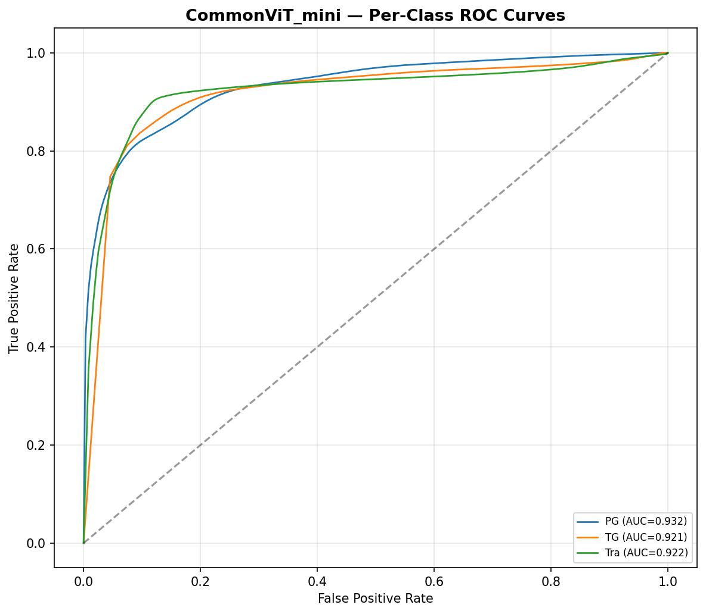
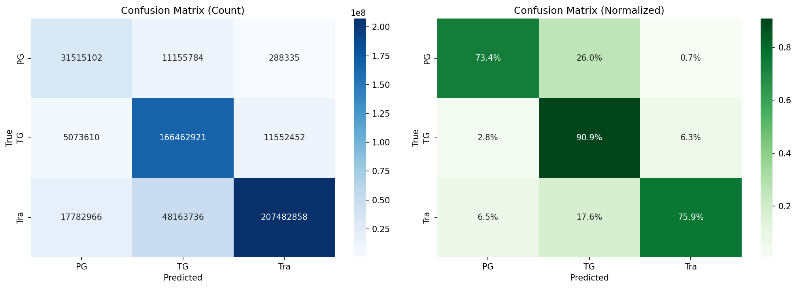
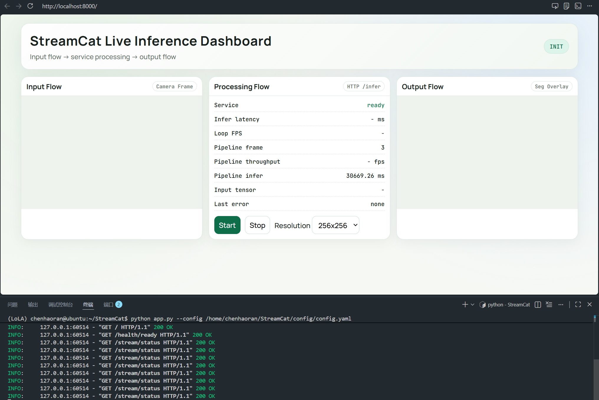

# 工作日志
## 2025.12
### 12.20

- 确定技术路线：
`[1] Zidi, Fadi Abdeladhim et al. LoLA-SpecViT: Local Attention SwiGLU Vision Transformer with LoRA for Hyperspectral Imaging`
- 研究文献提供的LoLA结构，其含有**低秩适配(Low Rank adaption)**＋**局部注意力机制(Local Attention)**。

### 12.26 
- 新建GitHub项目LoLA-hsViT(结构如**图1**);
- 采用公开地理遥感高光谱数据集：
https://rsidea.whu.edu.cn/resource_WHUHi_sharing.htm
- 定义了`HDR2MAT.py`、`LoLA_hsViT.py`、`training.py`, 分别完成了对原始高光谱数据集的读取、处理、转换，模型的构建、训练和可视化。训练的参数完全内置于类和函数内部，超参数全部定义在`training.py`文件头部，且需要在文件内手动注册数据集格式（如**图2**）。

**图1**

**图2**


### 12.28
- 用公开数据集`WHU-Hi-LongKou`在组服务器上跑通了程序，包括原始数据转换、数据集构建、特征波段筛选、服务器部署训练。
- **问题**: 原程序提供的结果展示和可视化方法太少，接口不明显。尝试改进，引入CAM。

## 2026.1
### 1.4
确定项目的整体任务：
- 构建标准化的高光谱数据采集与标准化预处理流程；
- 由最初的单纯PCA分析，完善到结合甲状旁腺组织学与生理光学特性的，有高判别力的光谱与空间融合特征筛选方法；
- 设计并实现适用于高光谱数据的Vision Transformer架构，完成甲状旁腺与周边组织的像素级精准分类；
- 轻量优化模型参量和训练算法，减小内存显存占用；实现多卡并行计算；
- 融合高光谱数据与其它可能的信息，通过跨模态注意力机制实现特征互补；
- 并通过多中心数据验证模型的泛化能力、鲁棒性，对训练好的模型进行简单部署，测试其实时性能，评估其临床转化潜力；
- 总结上述结论，尝试提出一整个标准化的流程:

```mermaid
graph LR
    A[收集数据] --> B[处理数据]
    B --> C[训练模型]
    C --> D[优化模型]
    D --> E[部署模型]
    E --> F[临床测试]
    
    style A fill:#e1f5fe,stroke:#01579b
    style B fill:#fff3e0,stroke:#e65100
    style C fill:#e8f5e8,stroke:#1b5e20
    style D fill:#f3e5f5,stroke:#4a148c
    style E fill:#ffebee,stroke:#b71c1c
    style F fill:#ede7f6,stroke:#311b92
```

### 1.11
- 毕设项目背景研究：
`[1] 高光谱遥感图像处理方法及应用, 赵春晖` 前两章：理论基础、特征提取技术;
`[2] Woo, S., Park, J., (2018). CBAM: Convolutional Block Attention Module.vol 11211. Springer, Cham`;
- 撰写开题报告；

### 1.20
- 毕设项目部署技术研究：
边缘部署和`Nvidia Jetson Orin NX`
- 毕设项目技术路线研究：
`[1] ZHANG Bing. Advancement of hyperspectral image processing and information extraction[J]. Journal of Remote Sensing`
- 研究在抽象基类基础上构建各类(`.mat`, `.tiff`等)数据集的方法，共用接口：
```python
class AbstractHyperspectralDataset(ABC, Dataset):
    @abstractmethod
    def _load_data(self) -> None:

    @abstractmethod
    def _preprocess_data(self) -> None:

    @staticmethod
    def _pad_with_zeros() -> np.ndarray:

    def _validate_raw_data(self) -> None:

    def _create_patches(self) -> None:

    def splitTrainTestDataset(self):

    def __len__(self) -> int:

    def __getitem__(self, idx: int) -> Tuple[torch.Tensor, torch.Tensor]:

class MatHyperspectralDataset(AbstractHyperspectralDataset)

class TiffHyperspectralDataset(AbstractHyperspectralDataset)
```

### 1.30
- 优化项目架构：
将不同功能的程序分装，创建结构如图
```
LoLA_hsViT/
├── config/                   # 参数设置
│   ├── __init__.py
│   ├── config.yaml
│   └── config_yaml.py
├── model/                    # 模型定义
│   ├── __init__.py
│   └── lola_vit.py
├── pipeline/                 # 工作流类
│   ├── __init__.py
│   ├── dataset.py            # 数据集类
│   └── trainer.py            # 训练器类
├── train.py                  # 模型训练入口
├── README.md
├── requirements.txt
└── ...
```
实现了工作程序中端到端的参数和方法传入。

### 2.6
- 修改数据集接口，新增`.npy`格式(`numpy`数组)高光谱数据集的导入方法，适配毕设任务。
- 更换甲状旁腺的高光谱数据集。来自**112名受试者**的**163组数据**，包括LU(left-upper), RD, RU, LD多类型数据。

### 2.14
- 调研现有临床路线的相关文献
```
[1] Lu G, Fei B. Medical hyperspectral imaging: a review. J Biomed Opt. 2014 Jan;19(1):10901. doi: 10.1117/1.JBO.19.1.010901. PMID: 24441941; PMCID: PMC3895860.
[2] Halicek M, Fabelo H, Ortega S, Callico GM, Fei B. In-Vivo and Ex-Vivo Tissue Analysis through Hyperspectral Imaging Techniques: Revealing the Invisible Features of Cancer. Cancers (Basel). 2019 May 30;11(6):756. doi: 10.3390/cancers11060756. PMID: 31151223; PMCID: PMC6627361.
```

### 2.20
- 年后开工，增添了固定参数的普通`Vision Transformer`和`U-net`用于对比分析；
- 调试模型，增加`pipeline/monitor.py`用于对训练时内存显存占用的实时分析：


### 2.22
- 在固定参数对比训练的基础上，增添针对两种ViT的消融实验，以确定最简结构的有效模型；
- 准备`TensorRT`推理部署；
- 系统整理收集到的临床理论文献，准备写作论文初稿。

### 2.23
- 采用小批次优化了数据标准化的执行速度和资源占用。
- 修改了一些BUG：
  1) 优化没删干净的全局标准化代码，致标准化两次，执行很慢；
  2) 新增受试者批处理，避免同一受试者数据泄露致测试精度虚高。
- **问题**： 引入强正则化后，训练集和验证集的`accuracy gap`仍然差30%，
`test acc`在65%停滞，其余提高泛化能力的手段(**Model EMA**，Exponential Moving Average)作用不明显。怀疑是数据集划分和样本偏差问题。

### 2.24
分析了数据集样本和标签分布。
- 整体类别分布（383 万样本，112 位受试者）

| 类别           |    样本数 | 占比 |
| ------------- | -------- | --- |
| TG (甲状腺)     | 1,300,832 | 33.9% |
| Tra (气管)      | 1,156,124 | 30.2% |
| MS (肌肉)       |   773,472 | 20.2% |
| PG (甲状旁腺)   |   289,773 |  7.6% |
| FAT            |   168,961 |  4.4% |
| ES (食管)      |    83,148 |  2.2% |
| Blood          |    41,598 |  1.1% |
| LN (淋巴结)     |    18,871 |  0.5% |

- 两个类出现 >5% 的占比偏移：

|类别 | train    |     test              |
| --  | ------  | ---------------------- |
|Tra  |  27.1%  |  40.4% (Δ = -13.3%)    |
|MS   |  21.6%  | test 15.5% (Δ = +6.1%) |

测试集中`Tra`样本严重过多，MS样本少。

- 受试者级别:
大量受试者缺失多数类别。例如 16 位受试者只含 `PG` 一个类（其余 7 类全部 missing）。`LN`, `Blood`, `ES` 三个稀有类仅分布在少部分受试者中，patient-level split 时极易导致某些类在测试集中几乎消失。这可能是 30% acc gap 的根因。

- 标签不平衡: 模型偏向预测 `TG`, `Tra`, `MS` 三大类即可获得 > 84% 的表面准确率，但泛化能力差。`Tra` 在测试集占 40%（训练集仅 27%），模型没见过足够多样的 Tra 样本。此外, `LN`, `Blood`, `ES` 仅存在于少数受试者中，划分后某一侧样本极少，模型学不到有效特征。

### 3.2
- 为保证学习质量，仅学习`PG`、`TG`、`Tra`三类，按照训练（像素）比`2：10：7`进行划分，参数为：
  - `patch_size` = 31
  - `pca_components` = 48
  - structure = `[1, 1, 2]`
  - `epochs` = 10

- 结果如下：




### 3.6
优化了工作流。

- 新增core.py、visualize.py，将功能和封装单拎出来。
- 新增数据集分析入口analyzer.py，兼容入口程序run.py。

用法：
```bash
bash

python run.py -a
```

### 3.7

- 修改`save_model`方法，现在保存为`.onnx`文件。
- 规整消融实验逻辑，去除`ablation.py`，将其功能下放至不同层的程序中：
  - 将衍生模型定义迁至`models`文件夹内，采用继承的方法创建不同结构的同类模型。
  - 扩充`core.py`的`ModelFactory._registry`字典，兼容衍生子类。
  - 合并`ablation.py`和`run.py`的训练逻辑。用户接口统一划入`run.py`。
- 应当继续做类别平衡调整。


### 3.13

- 加入了Nvidia MONAI推理前端：
https://github.com/Aloudname/StreamCat.git
详见`StreamCat/README.md`。提供流式的视频帧/单/批次hsi数据输入、本地(`localhost:8000`)部署、快速http响应。
启动效果：


### 3.17

- 采用新标记的数据集，有五例样本的数据标签和图像尺寸不匹配，忽略处理。
- 去除不匹配的数据后，用于构建数据集的样本共135例，来自96位受试者。
- 每例样本格式为`Name_YYMMDD_Direction_Merged.mat`，储存在`bishe/mat`，含键值：
  - `img`: 原始光谱数据，`(C, H, W)` = `(276, 700, 700)`；
  - `gt_label`: 对应标签数据，`(H, W)` = `(700, 700)`。

- 其标签类别和占比如下：

| 类别           |  占比  |
| ------------  | ----- |
| TG (甲状腺)    | 33.9% |
| Tra (气管)     | 30.2% |
| PG (甲状旁腺)   |  7.6% |

- 分别采用fisher指标统计（剩余96）、直接PCA截取（剩余48、31、15）两种手段降维，分别生成`bishe/fisher`、`bishe/pca_48`、`bishe/mat_31`、`bishe/mat_15`目录。保存格式均为numpy数组，保存名称为`Name_YYMMDD_Direction.npy`（数据文件）以及对应的`Name_YYMMDD_Direction_gt.npy`（标签文件）。
- 另外有RGB图像`(C, H, W)` = `(3, 700, 700)`，用于对照确认图像质量。其目录为`bishe/rgb`，命名格式为`Name_YYMMDD_Direction_Merged_rgb.png`。

### 3.20

- 改进训练流程，用自定义上下文管理器封装各阶段。
- 前期实验发现对前景像素分类效果不理想，因此考虑将单独的分类头变为二阶段分类头。第一个分类头`fg_bg_head`，用于专门分割前景背景；第二个分类头`fg_class_head`，用于在前景类内部分类不同的像素。
- 训练阶段做对应调整，采用`HierarchicalSegLoss`损失，定义为：

$$
\mathcal{L}_{\text{total}} = w_{\text{cls}} \cdot \mathcal{L}_{\text{cls}} + w_{\text{bgfg}} \cdot \mathcal{L}_{\text{bin}}
$$

- 其中，$w_{\text{cls}}$为对前景/背景二分类损失$\mathcal{L}_{\text{cls}}$的权重，$w_{\text{bgfg}}$为对前景/背景二分类损失$\mathcal{L}_{\text{bin}}$的权重。以下为详细推导。

---

#### 推导过程

定义：**在模型最后一层未激活的原始输出**为**logits**，logits反映了各类别的未归一化得分。

对真实类别为 \(y\) 的单个像素，设模型输出的 logits 为 \(\mathbf{z} \in \mathbb{R}^{C}\)。

对于整个批次，原始形状为 `(B, C, H, W)`，在损失计算前会被展平为 `(N*H*W, C)`，然后对每个像素独立计算。

首先通过 softmax 将 logits 转换为概率$p_{c}$：

\[
p_c = \frac{\exp(z_c)}{\sum_{j=1}^C \exp(z_j)},\quad c=1,\dots,C
\]

定义真实类别上的概率为 $p_t$，得$p_t = p_y$。

对于容易区分的样本，需降低其权重，对难分类别样本分配更多注意力。
因此，Focal Loss 引入调制因子 $(1-p_t)^\gamma$ 来降低易分样本的权重：

\[
\mathcal{L}_{\text{FL}} = - (1-p_t)^\gamma \log(p_t)
\]

接下来对于有无标签平滑的两种情况，分别讨论。

**(1) 无标签平滑**

此时损失为：

\[
\mathcal{L}_{\text{FL}} = - (1 - p_t)^\gamma \log(p_t)
\]

若有类别权重 \(w_y\)，则乘以该权重：

\[
\mathcal{L}_{\text{FL}} = - w_y \cdot (1 - p_t)^\gamma \log(p_t)
\]

**(2) 带标签平滑**

设平滑因子为 \(\varepsilon\)，平滑后的目标分布为：

\[
q_c = (1 - \varepsilon) \cdot \mathbf{1}_{c=y} + \frac{\varepsilon}{C}
\]

此时损失为：
\[
\mathcal{L}_{\text{FL}}^{\text{smooth}} = - (1 - p_t)^\gamma \sum_{c=1}^C q_c \log(p_c)
\]

若有权重 \(w_y\)，则乘以 \(w_y\)：
\[
\mathcal{L}_{\text{FL}}^{\text{smooth}} = - w_y \cdot (1 - p_t)^\gamma \sum_{c=1}^C q_c \log(p_c)
\]

---

根据上述推导，可组合得出$\mathcal{L}_{\text{total}}$，即`HierarchicalSegLoss`损失函数的表达式。

将分割任务分解为**背景/前景二分类**和**前景子类多分类**两部分。
设总类别数为 $C_{\text{total}}$，其中 $0$ 为背景，$1,\dots,C_{\text{total}}-1$ 为前景子类。
原始目标标签 $y \in \{0,\dots,C_{\text{total}}-1\}$，忽略索引记为 $\text{ignore}$。

模型输出有两个分支：
- $\mathbf{z}_{\text{bg}}$：二分类 logits，形状为 `(N*H*W, 2)`
- $\mathbf{z}_{\text{fg}}$：前景子类 logits，形状为 `(N*H*W, C_{\text{total}}-1)`

对应于两个分支，模型输出包含两部分的损失如下。

**(1) 前景子类损失**

构造前景子类标签 $y_{\text{fg}}$：
\[
y_{\text{fg}} = \begin{cases}
y - 1, & \text{if } y > 0 \\
\text{ignore}, & \text{otherwise}
\end{cases}
\]
前景子类损失直接使用标准 `FocalLoss`（公式 `1.1` 或 `1.2`，带类别权重和标签平滑）：
\[
\mathcal{L}_{\text{fg}} = \text{FocalLoss}(\mathbf{z}_{\text{fg}},\; y_{\text{fg}})
\]

**(2) 二分类损失**

二分类时，logits 为标量 $z\in\mathbb{R}$，经 sigmoid 得前景概率 $p = \sigma(z) = \frac{1}{1+e^{-z}}$，背景概率为 $1-p$。
另指出，在该阶段还未细粒度区分前景中的各类标签，因此记 $0$ 表示背景， $1$ 表示所有类前景。

由此，构造二分类阶段的真实标签 $y_{\text{bin}} \in \{0,1\}$：

\[
y_{\text{bin}} = \begin{cases}
1, & \text{if } y > 0 \\
0, & \text{if } y = 0 \\
\text{ignore}, & \text{if } y = \text{ignore}
\end{cases}
\]

二分类损失使用 `Binary Focal Loss`：

\[
\mathcal{L}_{\text{bin}} = \text{FocalLoss}_{\text{bin}}(\mathbf{z}_{\text{bg}},\; y_{\text{bin}})
\]

**(3) 总损失**

最终总损失为两者的加权和：

\[
\mathcal{L}_{\text{total}} = w_{\text{fg}} \cdot \mathcal{L}_{\text{fg}} + w_{\text{bgfg}} \cdot \mathcal{L}_{\text{bin}}
\]

其中 $w_{\text{fg}}$ 和 $w_{\text{bgfg}}$ 是人为指定的权重。

另外，所有损失计算前，可以通过掩码 $\mathcal{V}$ 剔除标签为 `ignore` 的像素（不参与梯度计算）。数学上可表示为仅对有效像素集合 \(\mathcal{V}\) 求和/平均：

\[
\mathcal{L} = \frac{1}{|\mathcal{V}|} \sum_{i \in \mathcal{V}} \ell_i
\]

其中 \(\ell_i\) 为第 $i$ 个像素的损失值。
推导完毕。

---

### 3.23

- 稍微修改程序，追加对两个子损失$\mathcal{L}_{\text{bin}}$和$\mathcal{L}_{\text{cls}}$的记录和损失曲线可视化。